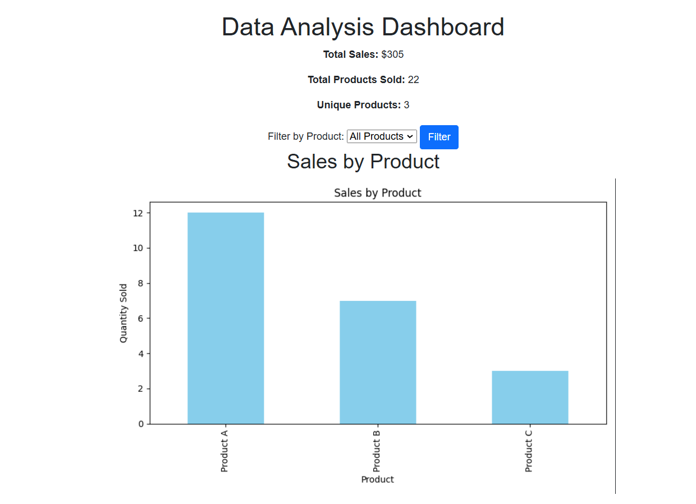

# Data Analysis Dashboard

This project is a simple **Data Analysis Dashboard** built using **Python**, **Flask**, **Pandas**, and **Matplotlib**. It provides an interactive way to analyze sales data, visualize trends, and filter results based on specific criteria.

---

## Features
- Display total sales, total products sold, and unique products.
- Filter sales data by product.
- Visualize sales by product using bar charts.
- Easy-to-extend structure for adding new analytics.

---

## Requirements
To run this project, you need to install the following Python libraries:
- Flask
- Pandas
- Matplotlib

Install the required libraries using:
```bash
pip install -r requirements.txt

```

----------

## How to Run Locally

Follow these steps to run the project on your local machine:

1.  Clone the repository:
    
    ```bash
    git clone https://github.com/engTasneemmaq/Data-Analysis-Dashboard.git
    
    ```
    
2.  Navigate to the project directory:
    
    ```bash
    cd Data-Analysis-Dashboard
    
    ```
    
3.  Install the required libraries:
    
    ```bash
    pip install -r requirements.txt
    
    ```
    
4.  Run the application:
    
    ```bash
    python app.py
    
    ```
    
5.  Open your browser and navigate to:
    
    ```
    http://127.0.0.1:5000/
    
    ```
    

----------

## Project Structure

```
data_analysis_dashboard/
├── app.py                # Main Flask application
├── data.csv              # Sample sales data
├── requirements.txt      # Python dependencies
├── static/               # Folder for generated static files (e.g., charts)
│   └── sales_plot.png    # Example bar chart
├── templates/            # HTML templates for the web interface
│   └── dashboard.html    # Main dashboard page

```

----------

## Data Description

The sample data (`data.csv`) contains the following columns:

-   **Date**: The date of the sale.
-   **Product**: The product name.
-   **Quantity**: The number of units sold.
-   **Price**: The price per unit.

Example:

```csv
Date,Product,Quantity,Price
2024-01-01,Product A,5,10
2024-01-02,Product B,3,20
2024-01-03,Product A,7,10

```

----------

## Screenshots

### Dashboard Example:



----------

## Future Improvements

Here are some potential features that can be added:

-   Use a database (e.g., SQLite or MySQL) instead of CSV files.
-   Add user authentication for restricted access.
-   Include more advanced visualizations with `Plotly` or `Seaborn`.
-   Add filters for date ranges and multiple products.

----------

## License

This project is licensed under the MIT License.

----------

## Contributions

Contributions are welcome! If you'd like to add features or fix bugs, feel free to fork the repository and create a pull request.

----------

